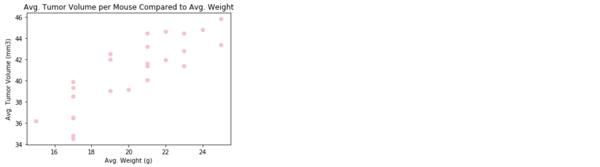

# clinical-trial-analysis

###### by Libardo Lambrano

## Overview <a name="top"></a>

Using Python Matplotlib to analyze potential treatments for squamous cell carcinoma (SCC), a commonly occurring form of skin cancer. The purpose of this study was to compare the performance of Pymaceuticals' drug of interest, Capomulin, versus the other treatment regimens.

* [Assignment Instructions / Tasks](#intro)
* [Solution](#solution)
* [Link to Jupyter Notebook](solution/clinical-trial-analysis.ipynb)

---

## Clinical Trial Analysis

---
<a name="intro"></a>
> **Instructions / Tasks**

* Check the data for any mouse ID with duplicate time points and remove any data associated with that mouse ID. [view solution](#01)

* Generate a summary statistics table consisting of the mean, median, variance, standard deviation, and SEM of the tumor volume for each drug regimen. [view solution](#02)

* Generate a bar plot using both Pandas's DataFrame.plot() and Matplotlib's pyplot that shows the number of total mice for each treatment regimen throughout the course of the study. [view solution](#03)

* Generate a pie plot using both Pandas's DataFrame.plot() and Matplotlib's pyplot that shows the distribution of female or male mice in the study. [view solution](#04)

* Calculate the final tumor volume of each mouse across four of the most promising treatment regimens: Capomulin, Ramicane, Infubinol, and Ceftamin. Calculate the quartiles and IQR and quantitatively determine if there are any potential outliers across all four treatment regimens. Using Matplotlib, generate a box and whisker plot of the final tumor volume for all four treatment regimens and highlight any potential outliers in the plot by changing their color and style. [view solution](#06)

* Select a mouse that was treated with Capomulin and generate a line plot of time point versus tumor volume for that mouse. [view solution](#07)

* Generate a scatter plot of mouse weight versus average tumor volume for the Capomulin treatment regimen. [view solution](#08)

* Calculate the correlation coefficient and linear regression model between mouse weight and average tumor volume for the Capomulin treatment. Plot the linear regression model on top of the previous scatter plot. [view solution](#09)

* Look across all previously generated figures and tables and write at least three observations or inferences that can be made from the data. Include these observations at the top of notebook.

<a name="solution"></a>
> **Solution**

---

**Observations**

1. There is a direct correlation between mouse weight and the average tumor volume for the Capomulin treatment, the heavier the mouse, data shows that tumors grow proportionally. 

2. In some instances Capomulin causes tumor volume to dicrease, especially at the beggining to the treatment, despite this initiaal positive devemopment the tendency is continuous growth over time.  

3. Ramicane seems to be a better medication, both the median and the standard deviation is low, when compared with other medications including Capomulin. 


<a name="01"></a>
**Remove mouse ID with duplicate time points**


<details><summary>click here to view steps</summary>

1. Import dependencies, read and combine CSV files

    ```
    # Dependencies and Setup
    import matplotlib.pyplot as plt
    import pandas as pd
    import scipy.stats as st
    import numpy as np

    # Study data files
    mouse_metadata_path = '../data/Mouse_metadata.csv'
    study_results_path = '../data/Study_results.csv'

    # Read the mouse data and the study results
    mouse_metadata = pd.read_csv(mouse_metadata_path)
    study_results = pd.read_csv(study_results_path)

    # Combine the data into a single dataset
    mouse_study_results = study_results.merge(mouse_metadata, on = 'Mouse ID')
    ```
2. Get all the data for the duplicate mouse ID. 
    ```
    mouse_id_dups = mouse_study_results[mouse_study_results[['Mouse ID', 'Timepoint']].duplicated() == True]
    ```
3. Create a clean DataFrame by dropping the duplicate mouse by its ID & Timepoint mix.
    ```
    mouse_study_results.drop_duplicates(subset=['Mouse ID', 'Timepoint'])
    ```
4. Removing the mouse with duplicated data completelly
    ```
    mouse_study_results = mouse_study_results[~mouse_study_results['Mouse ID'].str.match('g989')]
    ```

    [Back to output](#01)
</details>

[Back to tasks](#intro) or [Back to the top](#top) 

---

<a name="02"></a>
**Summary statistics table**


<details><summary>click here to view steps</summary>

1. Method 1 - creating multiple series and putting them all together at the end
    
    ```
    mean = mouse_study_results.groupby('Drug Regimen')['Tumor Volume (mm3)'].mean()
    median = mouse_study_results.groupby('Drug Regimen')['Tumor Volume (mm3)'].median()
    variance = mouse_study_results.groupby('Drug Regimen')['Tumor Volume (mm3)'].var()
    standard_deviation = mouse_study_results.groupby('Drug Regimen')['Tumor Volume (mm3)'].std()
    SEM = mouse_study_results.groupby('Drug Regimen')['Tumor Volume (mm3)'].sem()

    # This method is the most straighforward, creating multiple series and putting them all together at the end.

    summary_statistics_1 = pd.DataFrame({'mean': mean,
                                        'median': median, 
                                        'var': variance, 
                                        'std': standard_deviation, 
                                        'sem': SEM})
    ```

2. Method 2 -  Generate a summary statistics table using a single groupby function
    
    ```
    summary_statistics_2 = mouse_study_results.groupby('Drug Regimen').agg({'Tumor Volume (mm3)': ['mean', 'median', 'var', 'std', 'sem']})
    summary_statistics_2
    ```

    [Back to output](#02)
</details>

[Back to tasks](#intro) or [Back to the top](#top) 

---

<a name="03"></a>
**Number of total mice for each treatment regimen (graph)**


<details><summary>click here to view steps</summary>

1. Generate a bar plot showing the total number of mice for each treatment throughout the course of the study using pandas.
    
    ```
    grp_mice_treatment = mouse_study_results.groupby(["Drug Regimen"])
    mice_per_treatment = grp_mice_treatment[["Mouse ID"]].nunique()

    mice_treat_plot = mice_per_treatment.plot(kind="bar", title="Number of Mice on Each Regimen", legend=False)
    mice_treat_plot.set_ylabel("Number of Mice")
    ```

    [Back to output](#03)
</details>

[Back to tasks](#intro) or [Back to the top](#top) 

---

<a name="04"></a>
**Distribution of female or male mice in the study (graph)**


<details><summary>click here to view steps</summary>

1. Generate a pie plot showing the distribution of female versus male mice using pandas
    
    ```
    grp_mice_gender = mouse_study_results.groupby(['Sex'])
    mice_gender = grp_mice_gender[['Mouse ID']].count()

    mice_gender_plot = mice_gender.plot(y='Mouse ID', kind='pie', autopct='%1.1f%%', title='Mice Gender Distribution', legend=False)
    mice_gender_plot.set_ylabel('')
    ```

    [Back to output](#04)
</details>

[Back to tasks](#intro) or [Back to the top](#top) 

---

<a name="06"></a>
**Final tumor volume for all four treatment regimens and highlight any potential outliers (graph)**


<details><summary>click here to view steps</summary>

1. Calculate the IQR and quantitatively determine if there are any potential outliers.
    
    ```
    treatments = ["Capomulin", "Ramicane", "Infubinol", "Ceftamin"]

    cap_tumor_vol = cap_regimen['Tumor Volume (mm3)']
    ram_tumor_vol = ram_regimen['Tumor Volume (mm3)']
    inf_tumor_vol = inf_regimen['Tumor Volume (mm3)']
    cef_tumor_vol = cef_regimen['Tumor Volume (mm3)']

    quartiles_cap = cap_tumor_vol.quantile([.25,.5,.75])
    lowerq_cap = quartiles_cap[0.25]
    upperq_cap = quartiles_cap[0.75]
    iqr_cap = upperq_cap-lowerq_cap
    lower_bound_cap = lowerq_cap - (1.5*iqr_cap)
    upper_bound_cap = upperq_cap + (1.5*iqr_cap)

    quartiles_ram = ram_tumor_vol.quantile([.25,.5,.75])
    lowerq_ram = quartiles_ram[0.25]
    upperq_ram = quartiles_ram[0.75]
    iqr_ram = upperq_ram-lowerq_ram
    lower_bound_ram = lowerq_ram - (1.5*iqr_ram)
    upper_bound_ram = upperq_ram + (1.5*iqr_ram)

    quartiles_inf = inf_tumor_vol.quantile([.25,.5,.75])
    lowerq_inf = quartiles_inf[0.25]
    upperq_inf = quartiles_inf[0.75]
    iqr_inf = upperq_inf-lowerq_inf
    lower_bound_inf = lowerq_inf - (1.5*iqr_inf)
    upper_bound_inf = upperq_inf + (1.5*iqr_inf)

    quartiles_cef = cef_tumor_vol.quantile([.25,.5,.75])
    lowerq_cef = quartiles_cef[0.25]
    upperq_cef = quartiles_cef[0.75]
    iqr_cef = upperq_cef-lowerq_cef
    lower_bound_cef = lowerq_cef - (1.5*iqr_cef)
    upper_bound_cef = upperq_cef + (1.5*iqr_cef)

    outlier_cap = cap_regimen.loc[(cap_regimen["Tumor Volume (mm3)"] < lower_bound_cap) | (cap_regimen["Tumor Volume (mm3)"] > upper_bound_cap)]

    outlier_ram = ram_regimen.loc[(ram_regimen["Tumor Volume (mm3)"] < lower_bound_ram) | (ram_regimen["Tumor Volume (mm3)"] > upper_bound_ram)]

    outlier_inf = inf_regimen.loc[(inf_regimen["Tumor Volume (mm3)"] < lower_bound_inf) | (inf_regimen["Tumor Volume (mm3)"] > upper_bound_inf)]

    outlier_cef = cef_regimen.loc[(cef_regimen["Tumor Volume (mm3)"] < lower_bound_cef) | (cef_regimen["Tumor Volume (mm3)"] > upper_bound_cef)]

    print(outlier_cap)
    print(outlier_ram)
    print(outlier_inf)
    print(outlier_cef)

2. Generate a box plot of the final tumor volume of each mouse across four regimens of interest

    ```
    tumor_data = [cap_tumor_vol, ram_tumor_vol, inf_tumor_vol, cef_tumor_vol]
    purple_diamond = dict(markerfacecolor='purple', marker='D')
    labels = treatments
    plt.boxplot(tumor_data, flierprops=purple_diamond, labels=labels)
    plt.title("Final Tumor Volume by Regimen")
    plt.xlabel("Drug Regimens")
    plt.ylabel("Tumor Volume (mm3)")
    plt.show()

    ```

    [Back to output](#06)
</details>

[Back to tasks](#intro) or [Back to the top](#top) 

---

<a name="07"></a>
**Time point versus tumor volume for a mouse treated with Capomulin (graph)**


<details><summary>click here to view steps</summary>

1. Identify the mice treated with Capomulin and select one
    
    ```
    capomulin_treatment = mouse_study_results.loc[mouse_study_results['Drug Regimen'] == 'Capomulin']
    i557_mouse = capomulin_treatment.loc[capomulin_treatment["Mouse ID"] == "i557"]

    ```
2. Plot graph 

    ```
    i557_mouse_timepoints = i557_mouse['Timepoint'].to_list()
    i557_mouse_tumor_vol = i557_mouse['Tumor Volume (mm3)'].to_list()
    plt.plot(i557_mouse_timepoints, i557_mouse_tumor_vol, color='orange', marker='^')
    plt.title('Tumor Volume for i557 During Trial')
    plt.xlabel('Timepoints')
    plt.ylabel('Tumor Volume (mm3)')
    plt.show()
    ```

    [Back to output](#07)
</details>

[Back to tasks](#intro) or [Back to the top](#top) 

---

<a name="08"></a>
**Scatter plot of mouse weight versus average tumor volume for the Capomulin treatment regimen (graph)**



<details><summary>click here to view steps</summary>

1. Capture average tumor size
    
    ```
    grp_mice_avg_tumor = capomulin_treatment.groupby('Mouse ID').mean()
    avg_tumor_size = grp_mice_avg_tumor['Tumor Volume (mm3)']

    ```
2. Capture average mouse weight

    ```
    grp_mice_weight = capomulin_treatment.groupby('Mouse ID').mean()
    avg_mouse_weight = grp_mice_weight['Weight (g)']
    ```
3. Plot graph
    ```
    plt.scatter(avg_mouse_weight, avg_tumor_size, color='pink', marker='o')
    plt.title('Avg. Tumor Volume per Mouse Compared to Avg. Weight')
    plt.xlabel('Avg. Weight (g)')
    plt.ylabel('Avg. Tumor Volume (mm3)')
    plt.show()
    ```

    [Back to output](#08)
</details>

[Back to tasks](#intro) or [Back to the top](#top) 

---

<a name="09"></a>
**Calculate the correlation coefficient and linear regression model between mouse weight and average tumor volume for the Capomulin treatment (graph)**


<details><summary>click here to view code</summary>
    
    ```
    cor_coeff = st.pearsonr(avg_mouse_weight,avg_tumor_size)[0]
    (slope, intercept, rvalue, pvalue, stderr) = st.linregress(avg_mouse_weight, avg_tumor_size)
    regress_values = []
    for weight in avg_mouse_weight:
        regress_values.append(weight * slope + intercept)
    line_eq = "y = " + str(round(slope,2)) + "x + " + str(round(intercept,2))

    plt.scatter(avg_mouse_weight, avg_tumor_size, color="pink", marker='o')
    plt.plot(avg_mouse_weight,regress_values,"r-", color="purple")
    plt.annotate(line_eq,(21,36),fontsize=12,color="purple")
    plt.title("Avg. Tumor Volume per Mouse Compared to Avg. Weight")
    plt.xlabel("Mouse Weight (g)")
    plt.ylabel("Average Tumor Volume (mm3)")
    plt.show()
    print(f"The correlation coefficient is {cor_coeff}")

    ```

    [Back to output](#09)
</details>

[Back to tasks](#intro) or [Back to the top](#top) 

---

